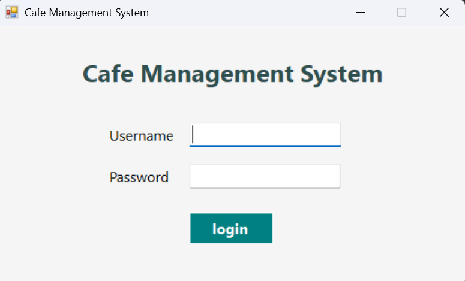
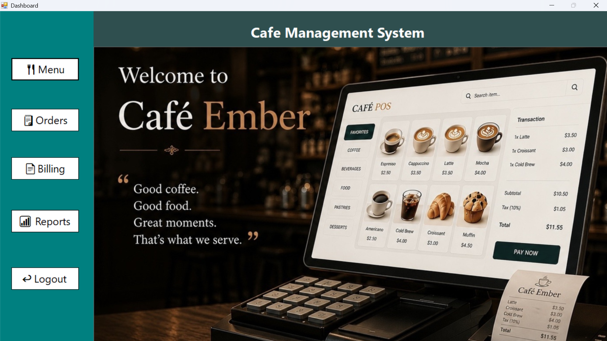
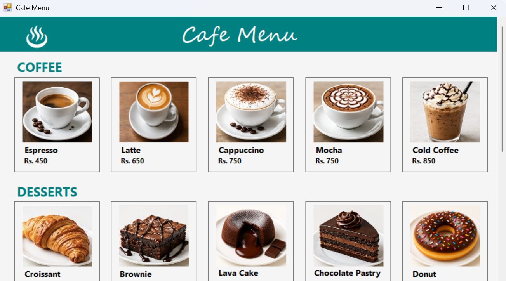
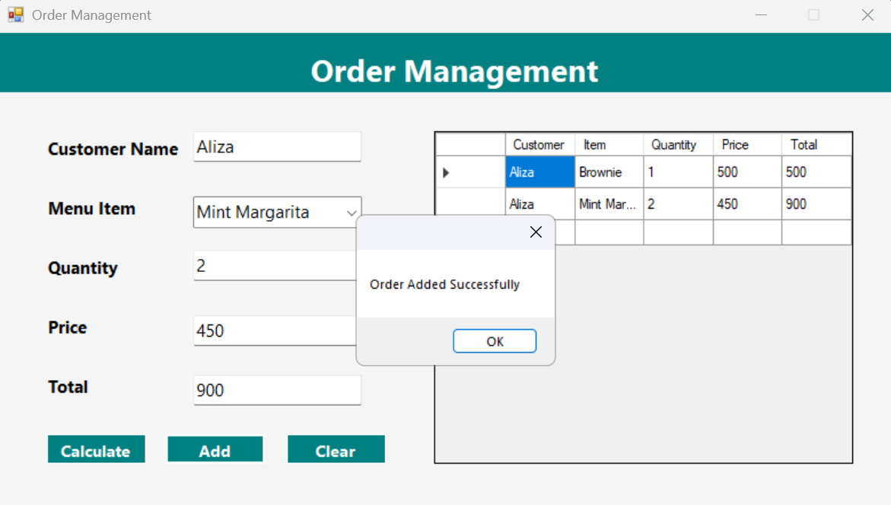
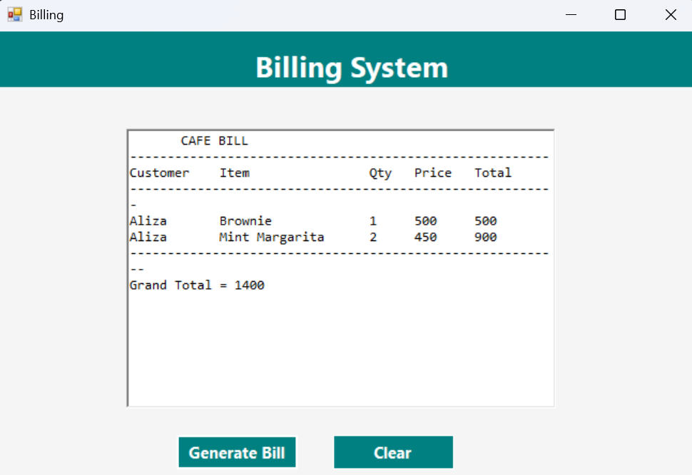
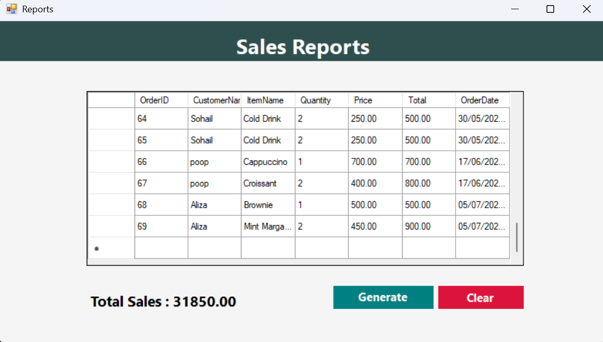

# ☕ Cafe Management System

A desktop-based Cafe Management & Billing System developed using **C# Windows Forms** and **SQL Server**.

---

## ✨ Features

- 🔐 Login System
- 📊 Dashboard
- 🍔 Menu Management
- 🛒 Order Management
- 🧾 Billing
- 📈 Reports
- 💾 SQL Server Database

---

## 🛠️ Technologies

- C#
- Windows Forms
- SQL Server
- Visual Studio

---

# 📸 Screenshots

## Login



---

## Dashboard



---

## Menu



---

## Orders



---

## Billing



---

## Reports



---

## Database

The SQL database script is included as:

```
script.sql
```

---

## Author

**Aliza Sohail**

GitHub: https://github.com/alizasohail103